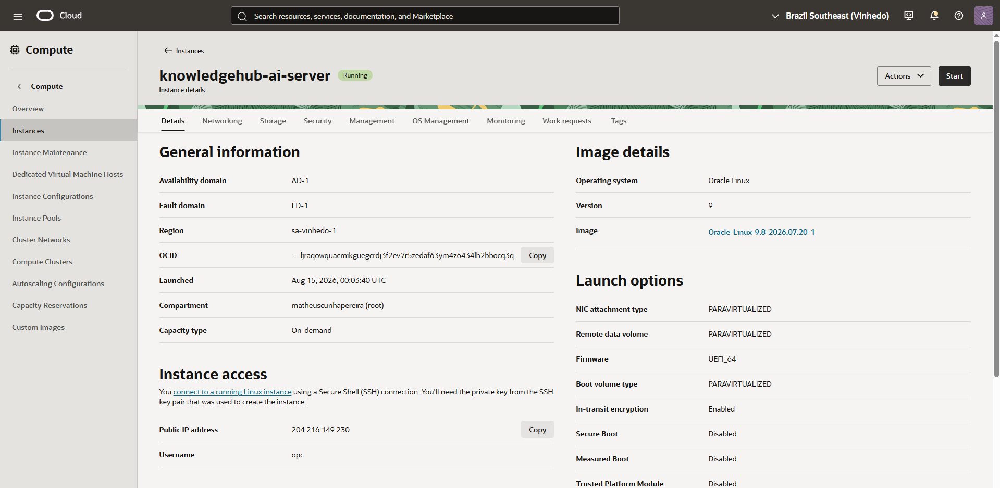
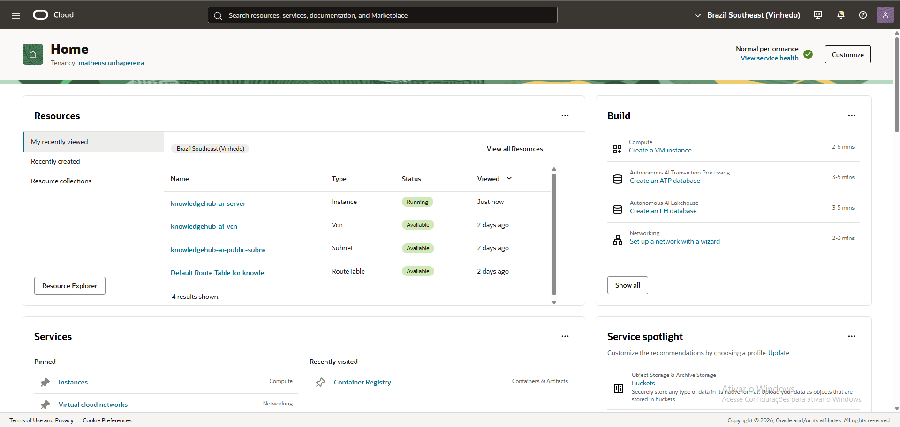
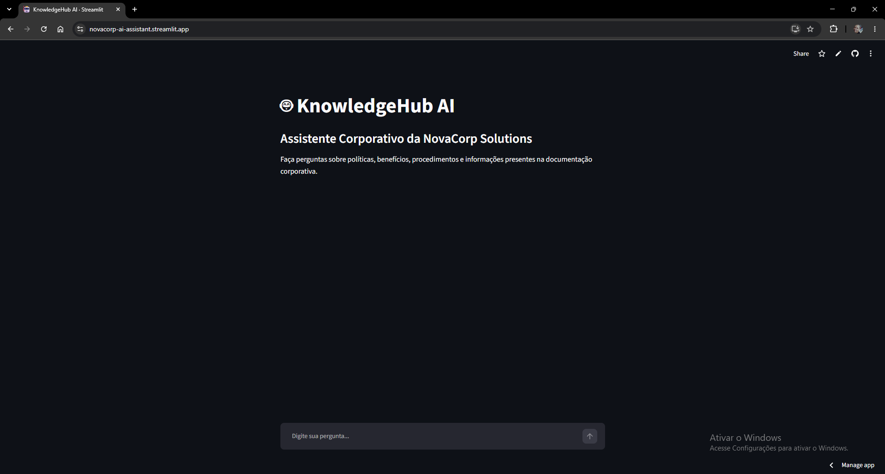

# 🤖 KnowledgeHub AI

> Assistente corporativo inteligente baseado em **RAG (Retrieval-Augmented Generation)** para consulta de documentos internos utilizando linguagem natural.

**KnowledgeHub AI** é uma aplicação de IA criada para transformar documentos corporativos em uma base de conhecimento acessível por meio de perguntas em linguagem natural.

A solução foi desenvolvida para o **Alura + Oracle Tech AI Challenge** e combina **Python, LangChain, ChromaDB, Sentence Transformers, Google Gemini e Streamlit**, com uma API FastAPI disponível para integração e testes locais.

---

## 🚀 Acesso à aplicação

### 🌐 Aplicação pública

**[Abrir o KnowledgeHub AI](https://novacorp-ai-assistant.streamlit.app/)**

A versão pública foi publicada gratuitamente no **Streamlit Community Cloud**, conectada ao repositório GitHub e à branch `deploy-streamlit`.

> **Observação:** a chave da API do Gemini é armazenada como Secret no ambiente de deploy e não é publicada no código-fonte.

---

## 🎯 Objetivo

O objetivo do KnowledgeHub AI é facilitar o acesso ao conhecimento corporativo.

Em vez de procurar manualmente informações em vários arquivos, o colaborador pode perguntar diretamente:

```text
Qual o prazo para solicitar reembolso?
```

ou:

```text
Quais são as regras para criação de senhas?
```

O sistema realiza uma busca semântica na base de documentos, recupera os trechos mais relevantes e utiliza esse contexto para gerar uma resposta fundamentada.

Além da resposta, o sistema apresenta as **fontes consultadas**.

Quando a documentação não contém informação relevante, o sistema evita inventar uma resposta e informa que não encontrou a informação solicitada.

---

## 💡 Problema que a solução resolve

Informações corporativas podem ficar espalhadas em diferentes documentos e formatos, tornando a consulta manual lenta e pouco prática.

O KnowledgeHub AI busca centralizar essa experiência por meio de uma interface conversacional capaz de:

- 📚 consultar documentos corporativos;
- 🔎 realizar busca semântica;
- 🧠 recuperar trechos relevantes;
- 🤖 gerar respostas contextualizadas;
- 📖 apresentar as fontes utilizadas;
- 🛡️ evitar respostas sem fundamentação documental.

---

# 🧠 Arquitetura

O projeto possui duas formas de utilização:

1. **API FastAPI**, utilizada para desenvolvimento, testes e integração;
2. **Aplicação Streamlit**, utilizada como interface pública final.

### Arquitetura da aplicação pública

```text
┌───────────────────────────┐
│          Usuário          │
└─────────────┬─────────────┘
              │
              ▼
┌───────────────────────────┐
│        Streamlit           │
│       streamlit/app.py    │
└─────────────┬─────────────┘
              │
              ▼
┌───────────────────────────┐
│        RAGService         │
└─────────────┬─────────────┘
              │
              ▼
┌───────────────────────────┐
│    RetrieverService       │
│      Busca semântica      │
└─────────────┬─────────────┘
              │
              ▼
┌───────────────────────────┐
│         ChromaDB          │
│      Banco vetorial       │
└─────────────┬─────────────┘
              │
       Contexto relevante
              │
              ▼
┌───────────────────────────┐
│      Google Gemini        │
│    Geração da resposta    │
└─────────────┬─────────────┘
              │
              ▼
┌───────────────────────────┐
│ Resposta + fontes usadas  │
└───────────────────────────┘
```

### API de desenvolvimento

```text
Usuário
   │
   ▼
Frontend React/Vite
   │
   │ POST /ask
   ▼
FastAPI
   │
   ▼
RAGService
   │
   ├── RetrieverService
   │       │
   │       ▼
   │    ChromaDB
   │
   └── GeminiService
           │
           ▼
      Google Gemini
```

A versão pública utiliza o **Streamlit diretamente com o `RAGService`**, evitando a necessidade de manter um segundo serviço web ativo apenas para atender a interface.

---

# 🔄 Como funciona o RAG

RAG significa **Retrieval-Augmented Generation**, ou Geração Aumentada por Recuperação.

De forma simplificada, o KnowledgeHub AI funciona assim:

### 1. 📥 Documentos

Os documentos corporativos são carregados pelo sistema.

### 2. ✂️ Divisão em trechos

Os conteúdos são divididos em partes menores chamadas *chunks*.

Isso facilita encontrar apenas os trechos relacionados a uma pergunta.

### 3. 🧮 Embeddings

Cada trecho é transformado em uma representação vetorial utilizando:

```text
sentence-transformers/paraphrase-multilingual-MiniLM-L12-v2
```

Esse modelo possui suporte multilíngue e é adequado para conteúdos em português.

### 4. 🗄️ Armazenamento

Os vetores são armazenados no **ChromaDB**.

### 5. 🔎 Pergunta

O usuário faz uma pergunta em linguagem natural.

### 6. 🧠 Busca semântica

A pergunta também é transformada em representação vetorial e comparada com os documentos armazenados.

O sistema recupera os trechos considerados mais relevantes.

### 7. 📝 Construção do contexto

Os trechos recuperados são reunidos e enviados ao modelo generativo como contexto.

### 8. 🤖 Geração

O **Google Gemini** recebe:

- a pergunta do usuário;
- os trechos recuperados;
- as regras do assistente.

O modelo então gera a resposta em português.

### 9. 📖 Fontes

Os documentos utilizados na recuperação são apresentados ao usuário.

### 10. 🛡️ Ausência de informação

Quando não existe conteúdo relevante na documentação, o sistema informa que não encontrou a informação solicitada.

Isso ajuda a reduzir respostas inventadas ou sem fundamentação.

---

# 🛠️ Tecnologias

| Tecnologia | Utilização |
|---|---|
| **Python 3.11** | Linguagem principal |
| **Streamlit** | Interface web pública |
| **FastAPI** | API REST para desenvolvimento e integração |
| **Uvicorn** | Servidor ASGI |
| **LangChain** | Orquestração do pipeline RAG |
| **ChromaDB** | Banco de dados vetorial |
| **Sentence Transformers** | Geração de embeddings |
| **Google Gemini** | Modelo generativo |
| **google-genai** | Integração com Gemini |
| **python-dotenv** | Variáveis de ambiente |
| **Pydantic** | Validação de dados |
| **React** | Frontend original |
| **TypeScript** | Desenvolvimento do frontend |
| **Vite** | Build e servidor do frontend |
| **Docker** | Empacotamento do backend |
| **Oracle Cloud Infrastructure** | Infraestrutura utilizada durante o projeto |
| **Git/GitHub** | Versionamento e colaboração |

---

# 📚 Base de Conhecimento

A base documental utilizada no MVP contempla diferentes formatos:

```text
backend/documents/
├── beneficios.csv
├── codigo_conduta.docx
├── faq_rh.md
├── manual_colaborador_novacorp.md
├── politica_seguranca.pdf
└── termos_lgpd.html
```

| Documento | Formato | Conteúdo |
|---|---|---|
| Manual do Colaborador NovaCorp | Markdown | Informações gerais e políticas corporativas |
| Benefícios | CSV | Benefícios oferecidos aos colaboradores |
| Código de Conduta | DOCX | Diretrizes e princípios de conduta |
| FAQ RH | Markdown | Perguntas frequentes de Recursos Humanos |
| Política de Segurança | PDF | Diretrizes de segurança da informação |
| Termos LGPD | HTML | Proteção de dados e direitos dos titulares |

A aplicação foi estruturada para trabalhar com múltiplos formatos documentais dentro de uma mesma base de conhecimento.

---

# 🤖 Inteligência Artificial

O KnowledgeHub AI utiliza o **Google Gemini** como modelo generativo.

O modelo utilizado pode ser configurado por variável de ambiente:

```env
GEMINI_MODEL=models/gemini-3.6-flash
```

A chave da API é configurada por:

```env
GEMINI_API_KEY=sua_chave_aqui
```

A chave **não deve ser inserida diretamente no código-fonte**.

---

# 🔎 Embeddings

O projeto utiliza:

```text
sentence-transformers/paraphrase-multilingual-MiniLM-L12-v2
```

O modelo foi escolhido por seu suporte multilíngue e adequação a consultas e documentos em português.

---

# 🗄️ Banco Vetorial

O **ChromaDB** é utilizado para armazenar e recuperar os embeddings.

A persistência local fica em:

```text
backend/vectorstore/chroma_db
```

O banco vetorial é utilizado durante o desenvolvimento e processamento local.

> O diretório do banco vetorial pode apresentar arquivos modificados durante a execução da aplicação. Esses arquivos não devem ser adicionados a commits acidentalmente.

---

# 🔌 API

O backend possui o endpoint:

## `POST /ask`

Responsável por receber perguntas e retornar respostas fundamentadas na documentação.

### Requisição

```http
POST /ask
Content-Type: application/json
```

```json
{
  "question": "Qual o prazo para solicitar reembolso?"
}
```

### Resposta

```json
{
  "answer": "O prazo para solicitar o reembolso é de até 15 dias corridos após a realização da despesa.",
  "sources": [
    "manual_colaborador_novacorp.md"
  ]
}
```

### Documentação interativa

Durante a execução local:

```text
http://127.0.0.1:8000/docs
```

---

# 🖥️ Interface Streamlit

A aplicação pública está em:

```text
streamlit/app.py
```

A interface oferece:

- 💬 chat em linguagem natural;
- 🤖 respostas do KnowledgeHub AI;
- 📚 apresentação das fontes;
- ⏳ indicador de processamento;
- ⚠️ tratamento de erros;
- 🚦 tratamento de limite `429`;
- 📱 layout responsivo;
- 🎨 identidade visual própria.

A aplicação Streamlit utiliza diretamente o `RAGService`, mantendo o pipeline RAG existente.

---

# 🌐 Deploy

## Streamlit Community Cloud

O deploy público foi realizado utilizando o **Streamlit Community Cloud**.

Configuração utilizada:

| Configuração | Valor |
|---|---|
| Repositório | `WARzGOD/knowledgehub-ai` |
| Branch | `deploy-streamlit` |
| Arquivo principal | `streamlit/app.py` |
| Plataforma | Streamlit Community Cloud |
| Segredo | `GEMINI_API_KEY` |

A documentação oficial do Streamlit recomenda selecionar o repositório, branch e arquivo de entrada da aplicação durante o deploy. Também é possível configurar Secrets e a versão do Python nas configurações avançadas. 

A aplicação atualmente pode ser acessada em:

**https://novacorp-ai-assistant.streamlit.app/**

> O Streamlit Community Cloud oferece hospedagem gratuita para aplicações Streamlit e integra o deploy diretamente ao GitHub.

---

# 🔐 Variáveis de ambiente

## Execução local

Crie um arquivo:

```text
.env
```

Exemplo:

```env
GEMINI_API_KEY=sua_chave_api
GEMINI_MODEL=models/gemini-3.6-flash
```

O arquivo `.env` não deve ser enviado ao GitHub.

## Streamlit Community Cloud

A chave `GEMINI_API_KEY` é cadastrada como **Secret** nas configurações da aplicação.

Não coloque a chave real:

- no código;
- no `README.md`;
- em arquivos versionados;
- em screenshots;
- em vídeos de demonstração;
- em commits do Git.

---

# ▶️ Execução local

## 1. Clonar o projeto

```powershell
git clone https://github.com/WARzGOD/knowledgehub-ai.git
cd knowledgehub-ai
```

## 2. Criar ambiente virtual

```powershell
python -m venv .venv
```

## 3. Ativar o ambiente

No Windows PowerShell:

```powershell
.\.venv\Scripts\Activate.ps1
```

## 4. Instalar dependências

Para executar a aplicação Streamlit:

```powershell
pip install -r requirements.txt
```

Para executar o backend:

```powershell
pip install -r backend/requirements.txt
```

## 5. Configurar a API

Configure o `.env` com:

```env
GEMINI_API_KEY=sua_chave_api
GEMINI_MODEL=models/gemini-3.6-flash
```

## 6. Executar o Streamlit

```powershell
streamlit run .\streamlit\app.py
```

A aplicação ficará disponível normalmente em:

```text
http://localhost:8501
```

## 7. Executar o backend FastAPI

Em outro terminal:

```powershell
cd backend
.\.venv\Scripts\Activate.ps1
python -m uvicorn app.main:app --reload
```

A API ficará disponível em:

```text
http://127.0.0.1:8000
```

Swagger:

```text
http://127.0.0.1:8000/docs
```

---

# 📂 Estrutura do Projeto

```text
knowledgehub-ai/
│
├── backend/
│   ├── app/
│   │   ├── api/
│   │   │   └── routes.py
│   │   ├── core/
│   │   │   └── config.py
│   │   ├── models/
│   │   │   └── schemas.py
│   │   ├── rag/
│   │   │   ├── document_loader.py
│   │   │   ├── embedding_store.py
│   │   │   ├── rag_service.py
│   │   │   ├── retriever.py
│   │   │   └── text_splitter.py
│   │   ├── services/
│   │   │   └── gemini_service.py
│   │   ├── utils/
│   │   │   └── logger.py
│   │   └── main.py
│   │
│   ├── documents/
│   ├── scripts/
│   ├── tests/
│   ├── vectorstore/
│   ├── .env.example
│   ├── Dockerfile
│   ├── constraints.txt
│   └── requirements.txt
│
├── frontend/
│   ├── src/
│   │   ├── components/
│   │   ├── services/
│   │   ├── types/
│   │   ├── App.tsx
│   │   └── main.tsx
│   └── package.json
│
├── streamlit/
│   └── app.py
│
├── .gitignore
├── requirements.txt
└── README.md
```

---

# 🧪 Validação do MVP

O projeto foi validado considerando os principais componentes da solução:

- [x] Backend FastAPI funcionando
- [x] Endpoint `/ask`
- [x] Frontend React funcionando
- [x] Comunicação frontend ↔ backend
- [x] Pipeline RAG funcionando
- [x] Busca semântica
- [x] ChromaDB
- [x] Embeddings multilíngues
- [x] Integração com Google Gemini
- [x] Respostas fundamentadas na documentação
- [x] Retorno das fontes utilizadas
- [x] Tratamento de perguntas sem informação relevante
- [x] Tratamento de erro `429`
- [x] Interface Streamlit funcionando localmente
- [x] Aplicação Streamlit publicada
- [x] Secret `GEMINI_API_KEY` configurado no ambiente de deploy
- [x] Aplicação pública acessível pela internet
- [x] Proteção das variáveis de ambiente

---

# 🧪 Exemplos de consultas

### 👥 Recursos Humanos

```text
Qual o prazo para solicitar reembolso?
```

### 🔐 Segurança da Informação

```text
Quais são as regras para criação de senhas?
```

### 🎁 Benefícios

```text
Quais são os benefícios disponíveis para os funcionários?
```

### ⚖️ LGPD

```text
Quais são os direitos do titular?
```

### 🚫 Informação inexistente

```text
Qual é o salário dos desenvolvedores da NovaCorp?
```

Para uma pergunta cuja resposta não esteja presente na documentação, o sistema informa que não encontrou a informação em vez de inventar um dado.

### Exemplo validado

**Pergunta:**

```text
Estou com uma despesa que fiz há 10 anos. Ainda posso pedir reembolso?
```

**Comportamento esperado:**

O sistema utiliza a regra documentada de que solicitações de reembolso devem ser realizadas em até **15 dias corridos** após a despesa e responde com base nessa informação.

---

# 🎥 Demonstração

O vídeo de apresentação do projeto será disponibilizado aos avaliadores por meio do Google Drive.

> 🔗 **Vídeo de apresentação:** `https://drive.google.com/file/d/1yTeRB7dAc9nkmmnAkk8b4JUUAQYs9KNS/view?usp=sharing`

---

# 🖼️ Evidências do projeto

```text
docs/
└── images/
    ├── oracle-oci-01.png
    ├── oracle-oci-02.png
    ├── oracle-oci-03.png
    └── streamlit-app.png
```

### ☁️ Oracle Cloud Infrastructure

#### Infraestrutura OCI

#### Configuração da infraestrutura



#### Evidência adicional



### 🤖 Aplicação KnowledgeHub AI



---

# ☁️ Oracle Cloud Infrastructure

O projeto também utilizou recursos da **Oracle Cloud Infrastructure (OCI)** durante o desenvolvimento e validação da infraestrutura.

A infraestrutura envolveu recursos de computação e rede, incluindo:

- Compute Instance;
- Virtual Cloud Network (VCN);
- subnet;
- Internet Gateway;
- regras de rede;
- acesso remoto à instância.

A OCI foi utilizada como parte da infraestrutura e evidências do projeto. A aplicação pública final, entretanto, está hospedada no **Streamlit Community Cloud**.

---

# ⚠️ Limitação da API Gemini

Durante os testes do MVP, a API gratuita do Gemini apresentou limitação de cota, retornando:

```text
429 RESOURCE_EXHAUSTED
```

Esse limite pertence à cota da API do Google Gemini e não ao KnowledgeHub AI.

A aplicação possui tratamento específico para esse cenário e apresenta uma mensagem orientativa ao usuário.

> Os limites de utilização da API podem variar conforme o modelo, conta, projeto e condições vigentes do serviço.

---

# 🔐 Segurança

O projeto adota práticas básicas de proteção de credenciais:

- 🔑 API Key armazenada em variável de ambiente/Secret;
- 🚫 `.env` ignorado pelo Git;
- 🚫 chaves não armazenadas no código;
- 🚫 tokens não armazenados no README;
- 🚫 arquivos temporários ignorados;
- 🚫 caches Python ignorados;
- 🚫 `node_modules` ignorado;
- 🚫 arquivos locais desnecessários ignorados.

A chave da API nunca deve ser publicada no repositório.

---

# 🧩 Diferenciais

### 🧠 RAG

As respostas são fundamentadas nos documentos recuperados pela aplicação.

### 📚 Base documental diversificada

O sistema trabalha com:

- CSV;
- DOCX;
- HTML;
- Markdown;
- PDF.

### 🔎 Busca semântica

O usuário pode fazer perguntas em linguagem natural sem precisar saber o nome exato do arquivo ou utilizar palavras-chave específicas.

### 🛡️ Respostas controladas

O prompt do `RAGService` orienta o modelo a utilizar somente a documentação recuperada.

### 📖 Fontes

As fontes utilizadas na recuperação são retornadas ao usuário.

### 🌐 Aplicação pública

O projeto possui uma versão funcional publicada na internet através do Streamlit Community Cloud.

### 💰 Deploy gratuito

A publicação da interface pública foi realizada sem a necessidade de contratar uma instância paga para manter um backend separado.

---

# 🗺️ Possíveis evoluções

O MVP pode evoluir futuramente com:

- [ ] autenticação de usuários;
- [ ] controle de acesso por departamento;
- [ ] upload de documentos pela interface;
- [ ] atualização automática da base vetorial;
- [ ] histórico persistente de conversas;
- [ ] monitoramento;
- [ ] métricas de utilização;
- [ ] avaliação automatizada das respostas;
- [ ] integração com sistemas corporativos;
- [ ] banco vetorial gerenciado;
- [ ] mecanismos adicionais de segurança.

Essas funcionalidades não fazem parte do MVP atual.

---

# 📊 Status

## 🚀 MVP funcional e publicado

O KnowledgeHub AI possui atualmente:

- ✅ pipeline RAG;
- ✅ recuperação semântica;
- ✅ banco vetorial;
- ✅ embeddings multilíngues;
- ✅ integração com Google Gemini;
- ✅ base documental diversificada;
- ✅ API REST;
- ✅ interface React original;
- ✅ interface Streamlit;
- ✅ apresentação das fontes;
- ✅ tratamento de erros;
- ✅ proteção das credenciais;
- ✅ deploy público;
- ✅ documentação técnica.

**Status: concluído e disponível para demonstração.**

---

# 📄 Licença

Projeto desenvolvido para fins educacionais e de demonstração tecnológica no contexto do **Alura + Oracle Tech AI Challenge**.

---

<div align="center">

## 🤖 KnowledgeHub AI

**Transformando documentos corporativos em conhecimento acessível através de Inteligência Artificial.**

</div>
